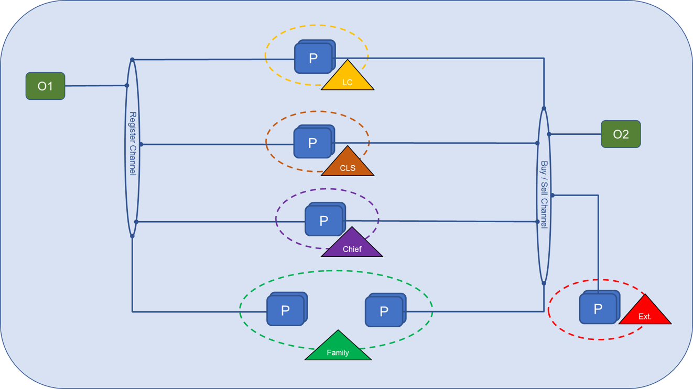

# DLT4PI_Landmanagement

**1. Description**

A Blockchain-based application for solving land conflicts in developing areas and preventing land grabbers from dispossessing locals and taking from them a sustainable future!

**2. Prerequisites**

**Versions of main packages used:**

* Docker: 18.06.1
* Hyperledger Fabric: 1.4.2
* Node: 8.16.0
* NPM: 6.4.1
* Angular: 8.0
* Express: 4.16.2

**Things to be Installed:**

* Install prerequisites of Hyperledger fabric:
    [https://hyperledger-fabric.readthedocs.io/en/release-1.2/prereqs.html](https://hyperledger-fabric.readthedocs.io/en/release-1.2/prereqs.html)

**3. Installation Instructions**

* Download Scripts:
    curl -sSL https://raw.githubusercontent.com/hyperledger/fabric/master/scripts/bootstrap.sh | bash -s 1.4.2
* Navigate to the folder ./path and run command ./startFabric.sh

**4. How to use the Frontend**

**5. System Architecture**

**6. Assumptions made for Development**

*  Tested on MacOS

**7. Errors / Bugs**

